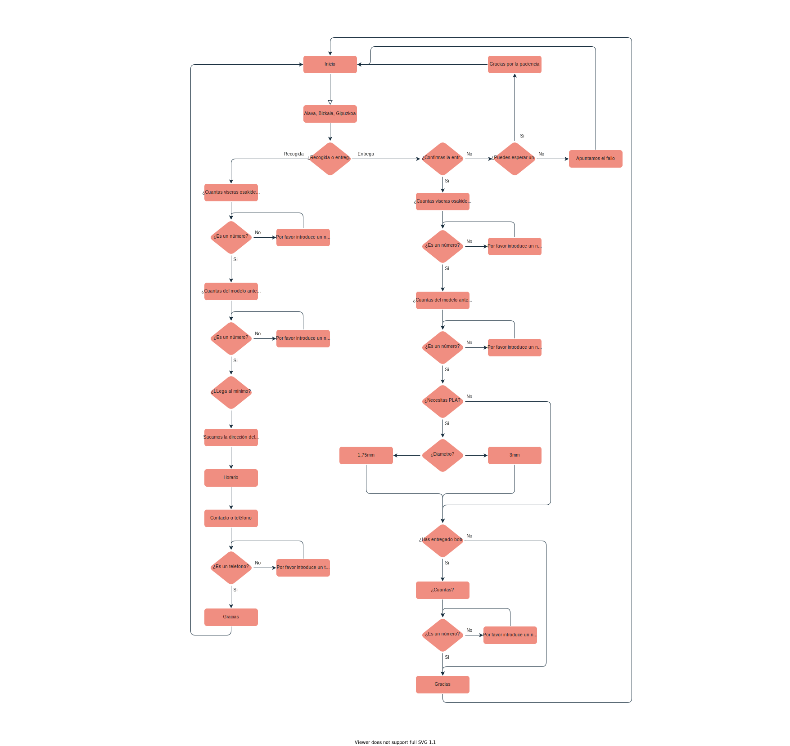

# RespiraBot
Este repo contiene un bot de Telegram capaz de recolectar informacion acerca de los envíos de ciertos productos por parte de los usuarios en un grupo. La lógica del bot es la siguiente:

La información recibida queda almacenada en el google Sheet creado para el Bot.
